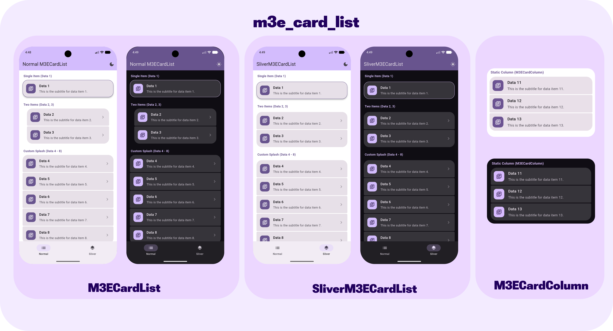

# M3E Card List



A Flutter package providing expressive, Material 3 card lists with dynamically rounded corners inside normal `ListView`s and `CustomScrollView`s (via slivers). It also provides a lightweight `M3ECardColumn` for static layouts.

It automatically calculates and draws the corners to fit exactly the [Material 3 Expressive](https://m3.material.io/blog/building-with-m3-expressive) spec for adjacent items. It gives extensive customization options for developers including customizable splash ripples, custom border colors, custom elevation, and highly tunable haptic feedback.

## Features

- **Dynamic border radius:** The first and last items get a larger outer radius while adjoining cards receive a smaller inner radius seamlessly.
- **Sliver Support:** Provides `SliverM3ECardList` out of the box to beautifully tie into your complex `CustomScrollView`s and `SliverAppBar`s. 
- **Lightweight Alternative:** Use `M3ECardColumn` for static, non-interactive lists.
- **Highly Customizable:** Offers parameters for `gap`, `innerRadius`, `outerRadius`, `padding`, `splashColor`, `highlightColor`, and `splashFactory`.
- **Haptic Feedback:** Includes an easy API for `haptic` impact levels (no haptic, light, medium, heavy) on tap.

## Usage

Simply import the package and use `M3ECardList`, `SliverM3ECardList` or `M3ECardColumn`.

```yaml
dependencies:
  m3e_card_list: ^0.0.1
```

```dart
import 'package:m3e_card_list/m3e_card_list.dart';

M3ECardList(
  itemCount: 5,
  itemBuilder: (context, index) {
      return Text('Data Item \$index');
  },
  onTap: (index) {
      print('Tapped \$index');
  },
  // Customize as needed:
  haptic: 3, // 0: None, 1: Light, 2: Medium, 3: Heavy
  splashColor: Colors.teal.withOpacity(0.2),
  highlightColor: Colors.teal.withOpacity(0.1),
);
```

To entirely remove the ripple effect from a card list, use the `splashFactory: NoSplash.splashFactory` combined with transparent splash/highlight colors.

```dart
M3ECardList(
  itemCount: 2,
  itemBuilder: (context, index) => Text('No ripple here!'),
  splashColor: Colors.transparent,
  highlightColor: Colors.transparent,
  splashFactory: NoSplash.splashFactory,
  onTap: (index) {},
)
```

## Static Column Example

If you don't need the performance overhead of a `ListView.builder` for small lists, you can use the lightweight `M3ECardColumn`. It is a simple wrapper for `Column` that supports all the same `InkWell` ripples, haptics, and customizations!

```dart
M3ECardColumn(
  children: [
    Text('Static Item 1'),
    Text('Static Item 2'),
    Text('Static Item 3'),
  ],
);
```

## Sliver Example

For use inside a `CustomScrollView`:

```dart
CustomScrollView(
  slivers: [
    SliverM3ECardList(
      itemCount: 10,
      itemBuilder: (context, index) => Text('Sliver Item \$index'),
      onTap: (index) {},
    ),
  ],
)
```

## Additional information

Check out the `example` folder for a fully-featured showcase app demonstrating how to use both normal and sliver lists, along with dynamic theming.
